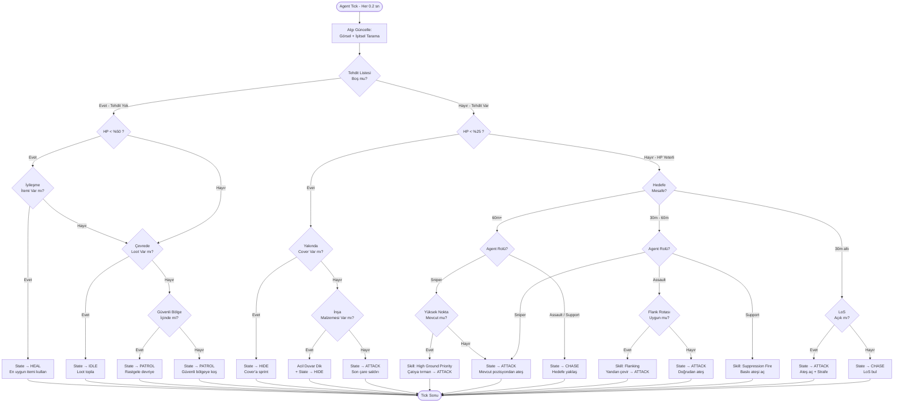
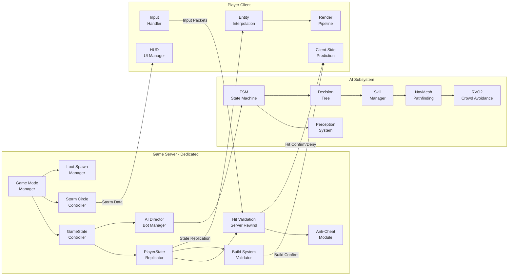

# 🏙️ BAKIRKÖY: SON ÇEMBER — Sistem Tasarım Dokümanı (STD)

**Proje Adı:** Bakırköy: Son Çember  
**Tür:** 3rd Person Shooter Battle Royale (Fortnite-vari)  
**Motor:** Unreal Engine 5 (Nanite + Lumen Pipeline)  
**Kapasite:** 100 Oyuncu (Gerçek + Bot karışık)  
**Harita:** Bakırköy, İstanbul — Yalnızca dış mekan (Exterior-Only)  
**Versiyon:** 1.0 — Production-Ready Blueprint  
**Tarih:** 2026-09-06  

---

> [!IMPORTANT]
> **Temel Kısıt:** Tüm oyun alanı dış mekandır. Binaların iç mekanlarına (interior) girilemez. Oynanabilir alanlar: sokaklar, kaldırımlar, çatılar, teraslar, parklar, sahil şeridi ve inşaat alanlarıdır. Bu kısıt, NavMesh hesaplamalarını dramatik şekilde sadeleştirir ve performansı artırır.

---

# BÖLÜM 1 — HARİTA POI ve STRATEJİK ZON TASARIMI

## 1.1 Harita Genel Yapısı

Bakırköy haritası, kuzeyde E-5 (D-100) otoyolunun geçilmez duvar hattı, güneyde Marmara Denizi kıyı hattı, doğuda Zeytinburnu sınırı, batıda Küçükçekmece Gölü kıyısı ile çevrelenmiştir. Toplam oynanabilir alan yaklaşık **3.2 km × 2.1 km** (~6.7 km²) boyutundadır.

Harita dört stratejik zon'a ayrılır:

```
┌─────────────────────────────────────────────────────────────┐
│  E-5 OTOYOLU (GEÇİLMEZ SINIR)                              │
├────────────────┬──────────────────┬──────────────────────────┤
│                │                  │                          │
│   KUZEY ZONU   │   MERKEZ ZONU   │    DOĞU ZONU             │
│  (İç Mahalle)  │  (Ticaret Aksı)  │  (Ataköy-Sahil)          │
│                │                  │                          │
├────────────────┴──────────────────┴──────────────────────────┤
│                                                             │
│                    BATI / GÜNEYBATI ZONU                     │
│                  (Marina-Hipodrom-Sahil)                     │
│                                                             │
├─────────────────────────────────────────────────────────────┤
│  MARMARA DENİZİ (GEÇİLMEZ SINIR)                            │
└─────────────────────────────────────────────────────────────┘
```

---

## 1.2 POI Detay Tabloları

### 🟢 KUZEY ZONU — "İç Mahalleler"

| # | POI Adı | Açıklama | Risk | Ödül (Loot) | Stratejik Not |
|---|---------|----------|------|-------------|---------------|
| K1 | **Kartaltepe Mezarlık Parkı** | Açık alan, seyrek ağaçlar, alçak duvarlar | 🟡 Orta | 🟡 Orta | Geçiş bölgesi; uzun menzilli çatışmalara açık |
| K2 | **Sakızağacı Çarşı Sokakları** | Dar sokaklar, tezgahlar, kaldırım bariyerleri | 🟢 Düşük | 🟢 Düşük-Orta | Yeni başlayanlar için güvenli iniş; gizlenme imkanı yüksek |
| K3 | **Cevizlik Caddesi Kavşağı** | Geniş yol, otobüs durakları, kaldırım üstü banklar | 🟡 Orta | 🟡 Orta | Çemberin sık geçtiği hat; rotasyon noktası |
| K4 | **Zuhuratbaba Türbesi Bahçesi** | Duvarlarla çevrili küçük açık alan, yüksek ağaçlar | 🟢 Düşük | 🟢 Düşük | Saklanma ve iyileşme (heal) için ideal |

### 🔴 DOĞU ZONU — "Ataköy Sahil Hattı"

| # | POI Adı | Açıklama | Risk | Ödül (Loot) | Stratejik Not |
|---|---------|----------|------|-------------|---------------|
| D1 | **Galleria AVM Dış Cephesi** | Devasa beton cephe, çatı terası, rampa sistemi | 🔴 Yüksek | 🔴 Çok Yüksek | En değerli loot; çatıda sniper avantajı, ancak dört yönden açık |
| D2 | **Ataköy Olimpiyat Stadyumu Çevresi** | Geniş plato, park alanı, etrafı açık | 🔴 Yüksek | 🟡 Orta-Yüksek | Araç enkazları cover sağlar; uzun menzil dominant |
| D3 | **Ataköy 1. Kısım Blokları Arası** | Sıralı apartman dış cepheleri, dar aralar | 🟡 Orta | 🟡 Orta | Flanking hareketi için ideal labirent yapı |

### 🔵 BATI / GÜNEYBATI ZONU — "Marina-Hipodrom Aksı"

| # | POI Adı | Açıklama | Risk | Ödül (Loot) | Stratejik Not |
|---|---------|----------|------|-------------|---------------|
| B1 | **Ataköy Marina** | İskele platformları, tekneler (üstüne çıkılabilir), açık su kenarı | 🔴 Yüksek | 🔴 Çok Yüksek | Legendary loot spawn; ama kaçış yolu az, arkası deniz |
| B2 | **Veliefendi Hipodromu** | Devasa düz alan, tribün yapıları, at koşu pistleri | 🔴 Yüksek | 🔴 Yüksek | En büyük açık alan POI; tribün üstü sniper cenneti |
| B3 | **İDO İskelesi ve Sahil Yürüyüş Yolu** | Uzun düz sahil promenadı, oturma alanları, düşük bariyerler | 🔴 Çok Yüksek | 🔴 Çok Yüksek | "Death Corridor" lakaplı hat; her iki yönden ateş alınır |
| B4 | **Botanik Park** | Yoğun ağaçlık, göletler, yürüyüş patikalar | 🟡 Orta | 🟡 Orta | Doğal cover; ambush (pusu) noktaları mevcut |

### 🟠 MERKEZ ZONU — "Ticaret Aksı"

| # | POI Adı | Açıklama | Risk | Ödül (Loot) | Stratejik Not |
|---|---------|----------|------|-------------|---------------|
| M1 | **Bakırköy Meydanı (Özgürlük Meydanı)** | Açık meydan, çevresi dükkân cepheleri | 🔴 Yüksek | 🔴 Yüksek | End-game çember favorisi; 360° tehdit |
| M2 | **İstanbul Caddesi** | Uzun yaya yolu, iki tarafı vitrin cepheleri | 🟡 Orta | 🟡 Orta | Rotasyon hattı; dar koridorda CQB dominant |
| M3 | **Bakırköy Adliyesi Önü** | Geniş merdiven, sütunlar, üst teras | 🟡 Orta-Yüksek | 🟡 Orta | Yükseklik avantajı + defansif konum |
| M4 | **Bakırköy Sahil Çay Bahçeleri** | Masalar, şemsiyeler (yıkılabilir cover), sahil kenarı | 🟡 Orta | 🟢 Düşük-Orta | Hızlı geçiş alanı; destructible environment test sahası |

---

## 1.3 Loot Tier Sistemi

| Tier | Renk Kodu | Örnek İçerik | Spawn Olasılığı |
|------|-----------|-------------|-----------------|
| **Common (C)** | ⬜ Gri | Tabanca, 1× Bandaj, 30 Mermi | %45 |
| **Uncommon (UC)** | 🟩 Yeşil | SMG, Küçük Shield, 60 Mermi | %28 |
| **Rare (R)** | 🟦 Mavi | Saldırı Tüfeği, Medkit, 90 Mermi | %16 |
| **Epic (E)** | 🟪 Mor | Keskin Nişancı, Büyük Shield, 120 Mermi | %8 |
| **Legendary (L)** | 🟧 Altın | Roket Atar, Full Shield Kit, Speed Boost | %3 |

**Loot Spawn Kuralı:** Yüksek risk POI'lerde (Marina, İDO İskelesi, Galleria Çatısı) Legendary spawn oranı **×3 çarpan** alır. Düşük risk POI'lerde Legendary spawn sıfıra yakındır.

---

## 1.4 Daralan Çember (Safe Zone / Storm Circle) Mekaniği

### Çember Fazları

| Faz | Bekleme Süresi | Daralma Süresi | Kalan Alan (%) | Fırtına Hasarı/sn |
|-----|---------------|---------------|----------------|-------------------|
| Faz 0 (Başlangıç) | 60 sn | — | %100 | 0 |
| Faz 1 | 90 sn | 120 sn | %70 | 1 HP/sn |
| Faz 2 | 75 sn | 90 sn | %45 | 2 HP/sn |
| Faz 3 | 60 sn | 75 sn | %25 | 5 HP/sn |
| Faz 4 | 45 sn | 60 sn | %12 | 8 HP/sn |
| Faz 5 | 30 sn | 45 sn | %5 | 10 HP/sn |
| Faz 6 (Final) | 20 sn | 30 sn | %1 | 15 HP/sn |

### Bakırköy'e Özgü Çember Adaptasyonu

**Problem:** Bakırköy'ün dar ara sokakları, çember duvarının geçtiği yerlerde "ölü koridorlar" (death corridors) oluşturabilir.

**Çözüm — Akıllı Çember Sistemi (Smart Circle Engine):**

1. **Sokak Kaçınma Algoritması:** Çember merkezi belirlenirken, algoritma sokak ağ haritasından (Street Graph) yararlanır. Çember duvarı mümkün olduğunca bina bloklarının ortasından değil, ana cadde hatlarından geçecek şekilde ayarlanır. Bu, oyuncuların her zaman en az bir kaçış rotasına sahip olmasını garanti eder.

2. **Koridor Genişletme (Corridor Widening):** Çember duvarı bir ara sokağı tam ortadan kestiğinde, o sokağın genişliği 4 metreden azsa, çember duvarı o nokta için lokal olarak ±3 metre kaydırılır (o dar sokağı tamamen güvenli bölgeye alır ya da tamamen fırtınaya bırakır). Yarı-yarıya kesim yapmaz.

3. **Dinamik Merkez Ağırlığı:** Faz 3'ten itibaren çember merkezi, haritanın yüksek POI yoğunluklu alanlarına (Merkez Zonu, Sahil Hattı) doğru %60 ağırlıkla çekilir. Bu, end-game'in her seferinde boş bir parkta bitmesini önler.

4. **Görsel Fırtına Duvarı:** Fırtına, İstanbul'a özgü koyu gri sis + yağmur efekti olarak render edilir. Duvar kenarında Boğaz rüzgârı sesi çalar — tematik olarak Bakırköy'ün kıyı havasını yansıtır.

---

# BÖLÜM 2 — SİLAH ve EKİPMAN SİSTEMİ (Weapon Skills)

## 2.1 Silah Sınıfları — Detaylı Skill Tablosu

### 🔫 Sınıf 1: Hafif Makineli Tüfek (SMG) — "Tıraş Makinesi"

| Skill Adı | Değer | Açıklama |
|-----------|-------|----------|
| **ADS Süresi** | 0.15 sn | Çok hızlı nişan; kalça ateşine (hip-fire) yakın hız |
| **ADS Yavaşlatma** | %10 hareket hızı kaybı | Neredeyse tam hızda hareket edilebilir |
| **Spray Pattern** | **Yuvarlak (Circular)** | İlk 8 mermi lazer, sonra saatin tersi yönünde yuvarlak saçılma. Yakın mesafede etkisiz, uzak mesafede kontrol zor |
| **Atış Hızı** | 12 mermi/sn | Çok yüksek cadence |
| **Şarjör Kapasitesi** | 30 mermi |  |
| **Reload Skill** | **Hızlı Değişim (Quick Swap)** — 1.4 sn | Animasyon kısa; kritik anlarda mümkün. Çift şarjör yok |
| **Hasar (Gövde)** | 18 HP | |
| **Hasar (Kafa)** | 36 HP (×2.0 çarpan) | |
| **Damage Falloff Başlangıcı** | **15 metre** | 15m sonra her 5m'de %15 hasar kaybı |
| **Damage Falloff Tabanı** | 40m+ mesafede hasar %30'a düşer | |
| **Efektif Menzil** | 0–20 metre (CQB dominant) | |

---

### 🔫 Sınıf 2: Saldırı Tüfeği (Assault Rifle) — "İstanbul Fırtınası"

| Skill Adı | Değer | Açıklama |
|-----------|-------|----------|
| **ADS Süresi** | 0.25 sn | Orta hızda nişan |
| **ADS Yavaşlatma** | %25 hareket hızı kaybı | ADS'deyken belirgin yavaşlama |
| **Spray Pattern** | **Ters-L (Inverted-L)** | İlk 5 mermi dikey yükselir, sonra sağa kayar. Kontrol edilebilir ama ustalık gerektirir |
| **Atış Hızı** | 8 mermi/sn | Dengeli cadence |
| **Şarjör Kapasitesi** | 25 mermi |  |
| **Reload Skill** | **Standart Değişim** — 2.0 sn | Orta süre. **Taktiksel Reload Skill:** Şarjörde 1+ mermi kaldıysa reload 1.6 sn'ye düşer (animasyonda bolt çekme atlanır) |
| **Hasar (Gövde)** | 28 HP | |
| **Hasar (Kafa)** | 56 HP (×2.0 çarpan) | |
| **Damage Falloff Başlangıcı** | **35 metre** | 35m sonra her 10m'de %10 hasar kaybı |
| **Damage Falloff Tabanı** | 80m+ mesafede hasar %55'e düşer | |
| **Efektif Menzil** | 10–50 metre (Mid-range king) | |

---

### 🔫 Sınıf 3: Keskin Nişancı Tüfeği (Sniper Rifle) — "Boğaz Kartalı"

| Skill Adı | Değer | Açıklama |
|-----------|-------|----------|
| **ADS Süresi** | 0.45 sn | Yavaş nişan; dürbün açılma animasyonu |
| **ADS Yavaşlatma** | %55 hareket hızı kaybı | ADS'deyken neredeyse sabit kalınmalı |
| **Spray Pattern** | **Lazer (Tek Atış)** | Bolt-action; her atış arasında 1.2 sn bolt çekme süresi. Saçılma yok |
| **Atış Hızı** | 0.83 mermi/sn (bolt-action) | |
| **Şarjör Kapasitesi** | 5 mermi |  |
| **Reload Skill** | **Yavaş Doldurma** — 3.2 sn (full reload) | Tek tek mermi doldurmaya geçiş yok; şarjör takma. **İptal Skill:** Reload animasyonu %60'ta iken sprint ile iptal edilebilir (3 mermi yüklenmiş sayılır) |
| **Hasar (Gövde)** | 95 HP | |
| **Hasar (Kafa)** | 190 HP (×2.0 çarpan) — Tek atış eliminasyon (Shield'siz) | |
| **Damage Falloff Başlangıcı** | **100 metre** | Çok uzak mesafeye kadar sabit hasar |
| **Damage Falloff Tabanı** | 200m+ mesafede hasar %80'e düşer | |
| **Efektif Menzil** | 40–180 metre (Long-range dominant) | |
| **Özel Skill: Nefes Tutma (Breath Hold)** | ADS'deyken 3 sn boyunca scope sway (sallanma) sıfırlanır. 3 sn sonra tekrar sallanır. Cooldown: 5 sn | |

---

### 🔫 Sınıf 4: Pompalı Tüfek (Shotgun) — "Bakırköy Tokadı"

| Skill Adı | Değer | Açıklama |
|-----------|-------|----------|
| **ADS Süresi** | 0.20 sn | Hızlı nişan ama hip-fire tercih edilir |
| **ADS Yavaşlatma** | %15 hareket hızı kaybı | |
| **Spray Pattern** | **Koni Dağılımı (Cone Spread)** | 9 saçma tanesi koni şeklinde yayılır. ADS daraltır; hip-fire geniş koni |
| **Atış Hızı** | 1.0 mermi/sn (pump-action) | Her atış sonrası pompa çekme: 0.7 sn |
| **Şarjör Kapasitesi** | 6 mermi |  |
| **Reload Skill** | **Tek Tek Doldurma (Shell-by-Shell)** — Her mermi 0.5 sn | Herhangi bir anda reload iptal edilip ateş edilebilir. 3 mermi yükledikten sonra acil ateş mümkün |
| **Hasar (Gövde, tüm taneler isabet)** | 110 HP (max) | |
| **Hasar (Kafa, tüm taneler isabet)** | 165 HP (×1.5 çarpan — kafa için azaltılmış) | |
| **Damage Falloff Başlangıcı** | **5 metre** | Çok kısa; 5m sonra saçma dağılımı hasarı hızla düşürür |
| **Damage Falloff Tabanı** | 15m+ mesafede hasar %15'e düşer | |
| **Efektif Menzil** | 0–8 metre (Point-blank specialist) | |
| **Özel Skill: Kapı Kırıcı (Door Breaker)** | İnşa edilmiş duvarlara (Build Piece) %250 bonus hasar. Rakip duvarını tek atışta kırabilir (Tahta) | |

---

### 🔫 Sınıf 5: Roket Atar (Rocket Launcher) — "Deprem"

| Skill Adı | Değer | Açıklama |
|-----------|-------|----------|
| **ADS Süresi** | 0.35 sn | Omuz nişanı (dürbün yok) |
| **ADS Yavaşlatma** | %40 hareket hızı kaybı | Ağır silah |
| **Spray Pattern** | **Yok (Projectile)** | Mermi fizik simülasyonu ile uçar; yerçekimi etkisi var (arc trajectory) |
| **Mermi Hızı** | 35 m/sn | Yavaş uçuş; hedefin kaçınma şansı var |
| **Şarjör Kapasitesi** | 1 mermi (tek atış) |  |
| **Reload Skill** | **Ağır Doldurma** — 3.8 sn | En yavaş reload. **Reload İptal Yok** — başlayınca bitirmek zorunda |
| **Hasar (Direkt İsabet)** | 120 HP | |
| **Hasar (Patlama Alanı, 3m yarıçap)** | 80 HP (merkeze uzaklığa göre linear azalma) | |
| **Hasar (Patlama Alanı, 5m yarıçap)** | 40 HP | |
| **Damage Falloff** | Yok — mermi nereye isabet ederse etsin sabit hasar | |
| **Efektif Menzil** | 5–60 metre (Projectile arc sınırlı) | |
| **Özel Skill: Yapı Yıkıcı (Structure Demolisher)** | İnşa parçalarını (Build Piece) patlama yarıçapındaki tüm parçalar dahil yok eder. Çelik dahil tek atışta yıkar |
| **Kendine Hasar (Self-Damage)** | Evet — 3m içinde ateş edilirse oyuncuya 60 HP hasar | |

---

## 2.2 Ekipman Skill Tablosu

| Ekipman | Etki | Cast Time (Kullanım Süresi) | Cooldown | Stack | Özel Skill |
|---------|------|---------------------------|----------|-------|------------|
| **Küçük Shield Potion** | +25 Shield (max 50'ye kadar) | 2.0 sn | Yok | 6 adet | **Hızlı Yudum (Quick Sip):** Kullanım sırasında yavaş yürüme mümkün (%30 hız) |
| **Büyük Shield Potion** | +50 Shield (max 100'e kadar) | 4.0 sn | Yok | 3 adet | **Tam Zırh (Full Armor):** 50 üstü shield'i sadece bu item verebilir |
| **Bandaj (Medkit-Küçük)** | +15 HP (max 75'e kadar) | 3.0 sn | Yok | 10 adet | **Seri Sarma (Quick Wrap):** Arka arkaya kullanımda her bandaj 0.3 sn daha hızlı (min 1.8 sn) |
| **Medkit (Büyük)** | HP'yi 100'e tamamlar | 8.0 sn | Yok | 2 adet | **Tam İyileşme (Full Recovery):** Kullanım sırasında tamamen hareketsiz kalınmalı; hasar alınırsa kesilir |
| **Speed Boost (Hız İksiri)** | %40 hareket hızı artışı, 12 sn süre | 1.0 sn | 30 sn | 3 adet | **Rüzgar Koşusu (Wind Sprint):** Süre boyunca düşme hasarı %50 azalır; yüksekten atlama rotaları açılır |

---

## 2.3 Oyuncu Sağlık Modeli

```
Toplam Dayanıklılık = HP (0–100) + Shield (0–100) = Maksimum 200

Hasar Önceliği: Önce Shield absorbe eder → Kalan hasar HP'den düşer
Shield Decay: Yok (kalıcı, hasar alana kadar)
HP Rejenerasyon: Yok (sadece item ile)
```

**Downed (Yere Serilme) Mekaniği:** Solo modda yok — direkt eliminasyon. Takım modlarında (Duo/Squad):
- Yere serilme HP'si: 50 HP (Bleedout)
- Bleedout süresi: 30 sn
- Kaldırma (Revive) süresi: 5.0 sn

---

# BÖLÜM 3 — ARKA PLAN AGENT (Bot Yapay Zeka) MİMARİSİ

> [!IMPORTANT]
> Bu bölüm, oyunun en kritik sistemidir. 100 oyunculu bir maçta gerçek oyuncu sayısı düştükçe (veya matchmaking dolmadığında) bot agent'lar farkı kapatır. Amaç, insan benzeri davranış gösteren, öngörülebilir ama aptal olmayan AI üretmektir.

## 3.1 Agent Durum Makinesi (Finite State Machine — FSM)

Agent'lar 6 ana durumda (state) bulunabilir. Her durumun giriş koşulları (Entry Conditions) ve çıkış koşulları (Exit Conditions) kesin olarak tanımlanmıştır.

### Durum Tanımları

#### 🟢 IDLE (Hareketsiz Bekleme)
- **Giriş:** Oyun başlangıcında paraşütle yere indikten sonra, veya tüm tehditler temizlendikten 15 sn sonra.
- **Davranış:** Bulunduğu noktada loot taraması yapar. En yakın loot chest'ine yönelir.
- **Çıkış →** `PATROL`: Çevrede loot kalmadığında veya 20 sn boyunca hiçbir loot bulamadığında.
- **Çıkış →** `CHASE`: 60m içinde düşman algılandığında.

#### 🔵 PATROL (Devriye)
- **Giriş:** IDLE'dan çıkış veya HEAL tamamlandıktan sonra.
- **Davranış:** NavMesh üzerinde tanımlı Patrol Route'larından birine girer. Rastgele waypoint seçimi. Cover noktalarına (araç, duvar köşesi) yakın rota tercih eder. Yürürken silah hazır konumda.
- **Çıkış →** `CHASE`: 60m içinde düşman görsel/işitsel algı (Visual/Audio Perception) ile tespit edildiğinde.
- **Çıkış →** `HIDE`: HP < %30 ve çevrede düşman algılandığında.
- **Çıkış →** `HEAL`: HP < %50 ve çevrede düşman algılanmadığında.

#### 🟡 CHASE (Kovalama)
- **Giriş:** Düşman algılandığında ve mesafe 15m–60m aralığındayken.
- **Davranış:** Hedefe doğru NavMesh üzerinde en kısa yoldan ilerler. Ancak doğrudan değil — her 3 sn'de bir cover-to-cover hareketi yapar (bir bariyerden diğerine koşar).
- **Çıkış →** `ATTACK`: Hedef 30m veya daha yakın mesafedeyken ve ateş hattı (Line of Sight — LoS) açıkken.
- **Çıkış →** `PATROL`: Hedef 90m'den uzaklaştığında veya 15 sn boyunca LoS kesildiğinde (hedef kaçtı).
- **Çıkış →** `HIDE`: HP < %25 ve hedef hâlâ ateş ediyorken.

#### 🔴 ATTACK (Saldırı)
- **Giriş:** Hedef LoS içinde ve 30m veya daha yakın.
- **Davranış:** Silah tipine göre ateş açar. ADS'e geçiş yapar. Ateş ederken strafe (yana kayma) hareketi uygular (zigzag). Şarjör bitince otomatik `HIDE` veya `CHASE`'e geçer.
- **Çıkış →** `CHASE`: Hedef 30m+ mesafeye açıldığında.
- **Çıkış →** `HIDE`: Şarjör bitti veya HP < %20.
- **Çıkış →** `IDLE`: Hedef eliminate edildiğinde.

#### 🟤 HIDE (Saklanma)
- **Giriş:** HP kritik seviyede VEYA şarjör boş VEYA sayıca dezavantaj (1v2+).
- **Davranış:** En yakın cover noktasına (NavMesh'te CoverNode olarak işaretlenmiş) sprint atar. Cover'a ulaştığında crouch (çömel) pozisyonuna geçer. Düşmana sırtını dönmez — cover kenarından peek (gözetleme) yapar.
- **Çıkış →** `HEAL`: Cover'a ulaştıktan 2 sn sonra, HP < %50 ise.
- **Çıkış →** `ATTACK`: Cover'dayken düşman 15m içine girerse (zorunlu savunma).
- **Çıkış →** `PATROL`: 20 sn boyunca düşman algılanmazsa.

#### 💚 HEAL (İyileşme)
- **Giriş:** HP < %50 ve aktif çatışma yok (en az 5 sn boyunca ateş almamış).
- **Davranış:** Envanterdeki en uygun iyileşme itemini kullanır. Öncelik: Medkit (HP < 30) → Bandaj (HP 30–70) → Shield (HP > 70, shield eksik). Kullanım süresi boyunca hareketsiz kalır.
- **Çıkış →** `ATTACK`: İyileşme sırasında hasar alırsa (interrupted).
- **Çıkış →** `PATROL`: İyileşme tamamlandığında ve HP > %70.
- **Çıkış →** `HIDE`: İyileşme tamamlandı ama hâlâ çevrede tehdit algısı var.

---

### Durum Geçiş Şeması (Özet)

```
                    ┌──────────────────────────────────┐
                    │                                  │
                    ▼                                  │
              ┌──────────┐     düşman yok, loot yok   │
    start ──▶ │   IDLE   │ ──────────────────────────▶ │
              └────┬─────┘                             │
                   │ düşman 60m içinde                  │
                   ▼                                   │
              ┌──────────┐      hedef kaçtı           │
              │  CHASE   │ ──────────────────▶ ┌───────┴──────┐
              └────┬─────┘                     │   PATROL     │
                   │ hedef 30m içi + LoS       └───────┬──────┘
                   ▼                                   ▲
              ┌──────────┐   hedef elim.               │
              │  ATTACK  │ ───────────────────────▶ IDLE
              └────┬─────┘                             ▲
                   │ HP kritik / şarjör boş            │
                   ▼                                   │
              ┌──────────┐    iyileşme gerek           │
              │   HIDE   │ ──────────────────▶ ┌───────┴──────┐
              └──────────┘                     │    HEAL      │
                                               └──────────────┘
```

---

## 3.2 Agent Rolleri ve Özel AI Skills

Her agent spawn olduğunda, sunucu tarafından 3 rolden birine atanır. Atama oranı: **%45 Assault, %25 Sniper, %30 Support**.

---

### 🗡️ ROL 1: Assault Agent

**Genel Profil:** Agresif, yakın-orta mesafe odaklı, flank hareketi uzmanı.

**Tercih Edilen Silahlar:** SMG (birincil), Saldırı Tüfeği (ikincil)

#### AI Skill: Flanking (Yandan Çevirme)

**Amaç:** Hedefe dikine (frontal) yaklaşmak yerine, hedefin yan tarafına (90° açıyla) dolaşarak saldırmak.

**Mantık Akışı:**

1. Hedef tespit edildiğinde, Agent → Hedef vektörü hesaplanır.
2. Bu vektöre dik (perpendicular) iki yön belirlenir: Sol-Flank ve Sağ-Flank.
3. NavMesh üzerinde her iki flank yönünde 20–30m mesafede erişilebilir bir cover noktası aranır.
4. **Seçim Kriteri:**
   - Hedefe LoS (ateş hattı) olan cover tercih edilir.
   - Hedefin bakış yönünün (facing direction) arkasına düşen cover **×2 ağırlıklı** olarak önceliklendirilir.
   - Her iki flank da uygunsa, rastgele biri seçilir (öngörülebilirlik kırılır).
5. Agent, seçilen flank noktasına cover-to-cover hareketi ile ilerler.
6. Flank noktasına ulaştığında ATTACK state'ine geçer ve yan ateşi açar.

**Geri Çekilme Kuralı:** Flank hareketi sırasında HP %30'un altına düşerse, flank iptal edilir ve en yakın cover'a HIDE state'inde geri çekilir.

#### AI Skill: Rush (Ani Hücum)

**Amaç:** Hedef iyileşme yaparken (HEAL state) veya inşa yaparken, sprint hızıyla doğrudan üstüne gitmek.

**Tetiklenme Koşulu:** Hedefin 3+ sn boyunca ateş etmediği algılandığında VE mesafe < 25m.

**Davranış:** Sprint + Hip-Fire SMG ile doğrudan hedefe yönelir. 8m mesafeye geldiğinde Pompalı Tüfeğe geçer (varsa).

---

### 🎯 ROL 2: Sniper Agent

**Genel Profil:** Defansif, uzak mesafe odaklı, yükseklik avantajı arayıcısı.

**Tercih Edilen Silahlar:** Keskin Nişancı (birincil), Tabanca (ikincil, zorunlu savunma)

#### AI Skill: High Ground Priority (Tepe Avantajı Arama)

**Amaç:** Otomatik olarak çatı katlarına, rampalara, tribün üstlerine veya inşa edilmiş yapıların tepelerine tırmanmayı hedeflemek.

**Mantık Akışı:**

1. Patrol veya Chase state'ine girildiğinde, Agent çevresindeki NavMesh node'larını yükseklik (Z-eksen) değerine göre sıralar.
2. **Yükseklik Eşiği:** Mevcut pozisyondan en az 3 metre daha yüksek olan node'lar "High Ground Candidate" olarak işaretlenir.
3. Adaylar arasından şu kriterlere göre seçim yapılır:
   - **Görüş Açısı (Field of View):** En geniş LoS alanına sahip olan (360° açık çatı > tek yönlü teras).
   - **Kaçış Rotası:** En az 2 farklı iniş rotası olan (tek merdiveni olan çatı cezalandırılır, ağırlığı ×0.5).
   - **Çember Uyumu:** Güvenli bölge (Safe Zone) içinde olan veya 30 sn içinde güvenli bölgeye ulaşılabilir olan.
4. Agent, hedef yüksek noktaya NavMesh rotası ile ilerler. Yolda merdivenler, rampalar veya inşa parçaları (kendi dikeceği rampa) kullanır.
5. Yüksek noktaya ulaştığında, `ATTACK` state'ine geçer ve "Scope Hold" pozisyonuna girer.

**Scope Hold Pozisyonu:**
- Crouch (çömelme) + ADS
- Nefes Tutma Skill'i aktif
- 180° yavaş pan (tarama) hareketi
- İlk düşman tespit edildiğinde ateş açılır
- Pozisyon ifşa edildikten sonra (2 atış sonrası), "Reposition Skill" aktifleşir

#### AI Skill: Reposition (Pozisyon Değiştirme)

**Amaç:** Konumu ifşa olan sniper'ın, aynı yüksek noktadaki farklı bir cover'a veya yakındaki alternatif yüksek noktaya taşınması.

**Tetiklenme:** 2 atış yaptıktan sonra VEYA düşman ateşi alındığında.

**Davranış:** 10–20m mesafede alternatif cover'a sprint. Yeni noktadan tekrar Scope Hold.

---

### 🛡️ ROL 3: Support Agent

**Genel Profil:** Takım odaklı (solo'da baskı ateşçisi), orta mesafe, hasar emici.

**Tercih Edilen Silahlar:** Saldırı Tüfeği (birincil), SMG (ikincil)

#### AI Skill: Suppression Fire (Baskı Ateşi)

**Amaç:** Rakibi cover'da kalmaya zorlamak için sürekli ateş açmak. Doğrudan öldürmeyi hedeflemez — rakibin hareket etmesini, iyileşmesini veya nişan almasını engeller.

**Mantık Akışı:**

1. Hedefin son bilinen cover pozisyonu belirlenir.
2. Agent, cover'ın kenarlarına (sol kenar, sağ kenar, üst kenar) otomatik olarak burst ateşi yönlendirir.
3. **Ateş Kalıbı:** 3 mermili burst → 0.4 sn ara → 3 mermili burst → 0.4 sn → ... (tam otomatik değil, mermi tasarrufu)
4. **Süre:** Maksimum 6 sn boyunca suppression uygulanır. Sonra 3 sn "assess" (değerlendirme) molası.
5. **Suppression başarılı mı?** Hedef 6 sn boyunca cover'dan çıkmadıysa → başarılı. Bu süre içinde Agent veya takım arkadaşı flank yapabilir.

**Müttefik Koordinasyonu (Squad Modunda):**
- Support Agent suppression yaparken, aynı squad'daki Assault Agent'a "Flanking Window" sinyali gönderilir.
- Bu sinyal, Assault Agent'ın `CHASE → Flank Skill` geçişini tetikler.

#### AI Skill: Revive Priority (Kaldırma Önceliği)

**Amaç (Takım Modunda):** Yere serilmiş (downed) takım arkadaşını öncelikli olarak kaldırmak.

**Tetiklenme:** Takım arkadaşı 30m içinde yere serildiğinde.

**Davranış:**
1. Mevcut ATTACK/CHASE iptal edilir.
2. Downed takım arkadaşına doğru sprint.
3. 5m kala smoke grenade atılır (varsa).
4. Kaldırma sırasında (5 sn) çevreye 180° tarama bakışı yapılır. Hasar alınırsa kaldırma iptal → HIDE.

---

## 3.3 Algı Sistemi (Perception System)

Agent'lar dünyayı iki duyuyla algılar:

### Görsel Algı (Visual Perception)
| Parametre | Değer |
|-----------|-------|
| Görüş Açısı (FOV) | 120° (ön koni) |
| Algı Mesafesi (Maksimum) | 80m (açık alan) |
| Algı Mesafesi (Dar Sokak) | 40m (LoS engeli sık) |
| Tanıma Süresi | 0.3 sn (açık alan), 0.6 sn (dar sokak, kalabalık cover) |
| Kamuflaj Cezası | Hareketsiz hedef → tanıma süresi ×2 |

### İşitsel Algı (Audio Perception)
| Ses Kaynağı | Algı Yarıçapı |
|-------------|--------------|
| Sprint | 25m |
| Ateş Etme (Susturucusuz) | 60m |
| Ateş Etme (Susturuculu) | 20m |
| İnşa (Yapı Dikme) | 30m |
| İtem Kullanımı | 10m |
| Crouch Yürüyüş | 8m |

**Algı Sonucu:** Algılanan her hedef, Agent'ın "Threat List" (Tehdit Listesi)'ne eklenir. Liste, **mesafe + son hasar miktarı** ile ağırlıklandırılarak sıralanır. En yüksek ağırlıklı hedef "Primary Target" olur.

---

## 3.4 Pathfinding Stratejisi ve Crowd Avoidance

### NavMesh Yapısı

Bakırköy haritası yalnızca dış mekandan oluştuğu için NavMesh, sokak ve açık alan yüzeyleri üzerinde oluşturulur. Bina footprint'leri NavMesh'ten tamamen çıkarılır (carve edilir).

**NavMesh Katmanları:**
1. **Zemin Katmanı (Ground Layer):** Sokaklar, kaldırımlar, park yolları, sahil promenadı
2. **Çatı Katmanı (Roof Layer):** Bina çatıları, teraslar (NavMesh Link ile zemine bağlanır)
3. **İnşa Katmanı (Build Layer):** Dinamik — oyuncuların/agent'ların diktiği rampalar ve duvarlar üzerinde anlık NavMesh güncellenmesi

### A* Algoritması Uyarlaması

Standart A*'ın üzerine eklenen modifikasyonlar:

1. **Cover Proximity Heuristic:** A* maliyet fonksiyonuna "cover yakınlığı" ek değeri eklenir. Cover noktalarına yakın path'ler tercih edilir (özellikle Chase state'inde).

2. **Threat-Aware Pathfinding:** Bilinen düşman pozisyonlarından geçen path'lere ek maliyet yüklenir. Agent, düşmanın LoS'unda olan sokaktan geçmek yerine bir sokak arkadan dolaşmayı tercih eder.

3. **Storm-Aware Pathfinding:** Fırtına duvarının yaklaştığı yöne doğru olan path'lere negatif maliyet (teşvik) verilir. Agent, fırtınadan kaçarken optimum rotayı hesaplar.

### Crowd Avoidance (Kalabalık Kaçınma) Skill'i

**Problem:** Dar Bakırköy sokaklarında 4–5 Agent aynı anda aynı rotayı kullanırsa, birbirine takılır ve bottleneck oluşur.

**Çözüm — RVO2 (Reciprocal Velocity Obstacles) Adaptasyonu:**

1. **Agent Yarıçapı:** Her Agent'ın 0.6m yarıçaplı bir "kişisel alan" (personal space) kapsülü vardır. Bu kapsüller çakışamaz.

2. **Velocity Obstacle Hesabı:** Her Agent, etrafındaki diğer Agent'ların hızlarını ve yönlerini okur. Çarpışma öngörüldüğünde, RVO2 algoritması her Agent'a yeni bir "tercih edilen hız vektörü" atar — birbirlerinden nazikçe sıyrılırlar.

3. **Dar Sokak Protokolü:** Sokak genişliği 3m'den az olan segmentlerde, aynı anda maksimum 2 Agent geçebilir. 3. Agent, sokak girişinde 0.5–1.5 sn rastgele bekleme (jitter wait) uygular. Bu, "trafik lambası" mantığı gibi çalışır.

4. **Sıra Kuralı:** Aynı cover noktasını hedefleyen iki Agent tespit edildiğinde, daha düşük HP'ye sahip olan Agent öncelik kazanır (hayatta kalma önceliği).

5. **Dağılma Komutu (Disperse Command):** Patlama yarıçapı silahları (Roket Atar) algılandığında, 5m yarıçaptaki tüm Agent'lar farklı yönlere dağılma sprint'i yapar.

---

## 3.5 Agent Zorluk Seviyeleri

Maçın ilerleyişine göre kalan agent'ların zorluk seviyesi dinamik olarak ayarlanır:

| Seviye | Nişan Doğruluğu | Reaksiyon Süresi | Hareket Kalitesi | Tetiklenme |
|--------|-----------------|-------------------|------------------|------------|
| **Easy** | %25 | 0.8 sn | Doğrusal, cover kullanmaz | Maç başlangıcı, Top 80 |
| **Medium** | %45 | 0.5 sn | Cover-to-cover, ara sıra strafe | Top 50 |
| **Hard** | %65 | 0.3 sn | Flank, strafe, peek | Top 25 |
| **Elite** | %80 | 0.15 sn | Tam AI Skill seti aktif, inşa yapar | Top 10 |

---

# BÖLÜM 4 — OYUN DÖNGÜSÜ ve BACKEND MANTIĞI

## 4.1 Server-Authoritative Mimari

```
┌─────────────────────────────────────────────────────────┐
│                    GAME SERVER                          │
│   (Dedicated Server — Unreal Engine Headless Build)     │
│                                                         │
│  ┌─────────────┐  ┌──────────────┐  ┌──────────────┐   │
│  │ Game State   │  │ Physics Auth │  │ Anti-Cheat   │   │
│  │ Manager      │  │ (Hit Valid.) │  │ Validator    │   │
│  └─────────────┘  └──────────────┘  └──────────────┘   │
│                                                         │
│  ┌─────────────┐  ┌──────────────┐  ┌──────────────┐   │
│  │ AI Director │  │ Storm Circle │  │ Loot Spawn   │   │
│  │ (Bot Mgr)   │  │ Controller   │  │ Manager      │   │
│  └─────────────┘  └──────────────┘  └──────────────┘   │
│                                                         │
└────────────────┬──────────────────────┬─────────────────┘
                 │ UDP (Reliable/Unreli)│
        ┌────────┴────────┐    ┌────────┴────────┐
        │  CLIENT 1       │    │  CLIENT N       │
        │  (Oyuncu)       │    │  (Oyuncu)       │
        │  - Input Gönder │    │  - Input Gönder │
        │  - Prediction   │    │  - Prediction   │
        │  - Interpolation│    │  - Interpolation│
        └─────────────────┘    └─────────────────┘
```

### Temel Kurallar

1. **Oyuncu istemcisi (client) ASLA** bir vuruşun isabetli olup olmadığına karar vermez. Client sadece "şu anda ateş ettim, nişangahım şu koordinattaydı" bilgisini sunucuya gönderir.
2. **Sunucu**, oyuncunun gönderdiği atış bilgisini alır ve **Server Rewind** tekniği ile doğrular (aşağıda detaylı).
3. Tüm sağlık (HP/Shield) değişimleri, item kullanımları, eliminasyonlar ve çember hareketleri sunucu otoritesindedir.

### Vuruş Doğrulama Sistemi: Hybrid Hit Detection

Oyun, saf Hit-Scan veya saf Projectile yerine **Hybrid** sistem kullanır:

| Silah Sınıfı | Tespit Yöntemi | Gerekçe |
|-------------|----------------|---------|
| SMG | **Hit-Scan** | Yüksek atış hızı; her mermi için projectile simüle etmek sunucu maliyetini aşar |
| Saldırı Tüfeği | **Hit-Scan** | Orta atış hızı; hit-scan yeterli |
| Keskin Nişancı | **Hit-Scan + Bullet Drop Simülasyonu** | Hit-scan'dir ama 100m+ mesafede sunucu tarafında yerçekimi sapması uygulanır. Client'ta da görsel mermi yolu (tracer) gösterilir |
| Pompalı | **Hit-Scan (Çoklu Ray)** | 9 ray cast, koni şeklinde yayılır. Her ray bağımsız isabet kontrolü |
| Roket Atar | **Projectile (Fizik Simülasyonu)** | Sunucu tarafında fizik engine ile simüle edilir. Yavaş mermi; oyuncunun kaçınabilmesi gerektiğinden projectile zorunlu |

### Server Rewind (Gecikme Telafisi)

1. Sunucu, her oyuncunun pozisyon geçmişini son **300ms** boyunca saklar (ring buffer, her 15ms'de bir snapshot).
2. Oyuncu ateş ettiğinde, paketiyle birlikte kendi client timestamp'ini gönderir.
3. Sunucu, oyuncunun ping'ini hesaplar ve dünyayı o oyuncunun "gördüğü ana" geri sarar (rewind).
4. O andaki tüm hitbox pozisyonlarına karşı raycast yapılır.
5. İsabet varsa → hasar uygulanır. Yoksa → "Miss" döner.

**Güvenlik Kontrolü:** Rewind süresi **maksimum 200ms** ile sınırlıdır. 200ms+ ping'e sahip oyuncular dezavantajlıdır (kasıtlı lag exploitation'ı önlemek için).

---

## 4.2 Skydiving Skill (Paraşüt/Dalış Mekaniği)

Oyun başlangıcında tüm oyuncular "Hava Otobüsü"nden (uçan platform) atlarlar. Bakırköy üzerinden geçen otobüs rotası her maçta rastgele belirlenir (Kuzey→Güney, Doğu→Batı, veya çapraz).

### Dalış Fazları

#### Faz 1: Serbest Düşüş (Free Fall)
| Parametre | Değer |
|-----------|-------|
| Dikey Hız (Max) | 60 m/sn |
| Yatay Hız (Max) | 25 m/sn |
| Kontrol | Sol stick/WASD — yön kontrolü |

**Skill: Rüzgâr Okuma (Wind Reading)**
- Haritanın üzerinde görünmez rüzgâr vektörleri tanımlıdır (Bakırköy'ün gerçek Lodos/Poyraz paternlerine dayalı).
- Rüzgâr yönünde dalış yapan oyuncu **%15 ek yatay hız** kazanır.
- Rüzgâra karşı dalış yapan oyuncu **%10 yatay hız kaybı** yaşar.
- HUD'da rüzgâr yönü ok işareti ile gösterilir. Rüzgârı okuyan oyuncu daha uzak mesafeye ulaşabilir — stratejik avantaj.

#### Faz 2: Paraşüt Açma (Glide)
| Parametre | Değer |
|-----------|-------|
| Tetiklenme | Otomatik — yerden 100m yükseklikte VEYA manuel tetik |
| Dikey Hız | 8 m/sn (yavaş iniş) |
| Yatay Hız | 15 m/sn |

**Skill: Hızlı İniş (Quick Drop)**
- Paraşüt açıldıktan sonra, oyuncu "dive" (dalış) input'u verirse paraşüt kapanır ve 2 sn boyunca tekrar serbest düşüş yapar (hızlanma).
- Sonra paraşüt tekrar otomatik açılır.
- Bu, deneyimli oyuncuların iniş zamanlamasını optimize etmesini sağlar.
- **Sınırlama:** Yerden 30m altında dive yapılamaz (düşme hasarı koruması).

#### Faz 3: Yere İniş
- İniş animasyonu: 0.5 sn (bu sürede silah çekilemez, ateş edilemez).
- İniş sonrası 0.3 sn hareket gecikmesi (inertia).
- **İlk 3 sn kuralı:** Yere inen oyuncu 3 sn boyunca hasar almaz (spawn protection — yalnızca diğer paraşütçülerden korunma).

---

## 4.3 İnşa Mekaniği (Building System)

Bakırköy'deki inşaat ve yıkım temasına uygun olarak, Fortnite'ın inşa mekaniği uyarlanmıştır. 4 malzeme yerine **3 malzeme** kullanılır:

### Malzeme Tablosu

| Malzeme | Kaynak | Toplama Hızı | Max Stack | Dikme Süresi | Başlangıç HP | Maks HP (Sertleşme Sonrası) | Sertleşme Süresi |
|---------|--------|-------------|-----------|-------------|--------------|------------------------------|-----------------|
| **Moloz (Enkaz)** | Yıkılmış araçlar, çöp konteynerleri, tezgahlar | 25 birim/vuruş | 300 | **0.6 sn** | 60 HP | 100 HP | 5 sn |
| **Tuğla** | Duvarlar, kaldırım taşları, bariyer blokları | 15 birim/vuruş | 250 | **0.9 sn** | 80 HP | 200 HP | 8 sn |
| **Çelik (İnşaat Demiri)** | İskele direkleri, demir parmaklıklar, jeneratörler | 8 birim/vuruş | 150 | **1.3 sn** | 100 HP | 350 HP | 12 sn |

### İnşa Parçaları

| Parça | Malzeme Maliyeti | Boyut | Kullanım |
|-------|-----------------|-------|----------|
| **Duvar (Wall)** | 10 birim | 3m × 3m | Korunma, LoS kesme |
| **Rampa (Ramp)** | 10 birim | 3m × 3m × 45° | Yükseklik kazanma |
| **Zemin (Floor)** | 10 birim | 3m × 3m | Köprü, platform |
| **Yarım Duvar (Half-Wall)** | 5 birim | 3m × 1.5m | Peek cover |

### İnşa Skill: Hızlı Dikme (Quick Build)

- Oyuncu inşa moduna geçiş süresi: **0.2 sn**
- Ardışık yapı dikme (Turbo Build): İlk parçadan sonra her sonraki parça **-0.1 sn** daha hızlı dikilir (minimum: Moloz 0.3 sn, Tuğla 0.5 sn, Çelik 0.8 sn)
- İnşa sırasında ateş edilemez; silaha geçiş süresi: **0.3 sn**

### İnşa Skill: Düzenleme (Edit)

- Oyuncu, kendi diktiği yapıları düzenleyebilir (kapı açma, pencere açma, yarım duvar kesme).
- Düzenleme süresi: **0.4 sn** (animasyon)
- Rakibin yapısı düzenlenemez — sadece yıkılabilir.

---

## 4.4 Oyun Akış Döngüsü (Game Loop)

```
LOBBY (Lobi)
  │
  ▼
PRE-GAME (60 sn — Bekleme Adası)
  │  100 oyuncu dolduğunda veya 120 sn timeout
  ▼
SKYDIVE PHASE (Hava Otobüsü + Dalış)
  │  Otobüs 30 sn boyunca haritayı geçer
  │  Atlamayan oyuncular otobüs sonunda zorla atılır
  ▼
EARLY GAME (Faz 0-1)
  │  Loot toplama, ilk çatışmalar
  │  Çember henüz daralmıyor (Faz 0) veya yavaş daralma (Faz 1)
  ▼
MID GAME (Faz 2-3)
  │  Rotasyonlar, stratejik konumlanma
  │  İnşa çatışmaları (Build Fights) yoğunlaşır
  ▼
LATE GAME (Faz 4-5)
  │  Küçük alan, yoğun çatışma
  │  Kaynaklar (malzeme, mermi) kıtlaşır
  ▼
END GAME (Faz 6 — Final Circle)
  │  Son 5-10 oyuncu
  │  Çember neredeyse bir nokta
  ▼
VICTORY / ELIMINATION
  │
  ▼
POST-GAME (Sonuç Ekranı — 15 sn)
  │  XP, istatistik, replay
  ▼
LOBBY'ye dönüş
```

### Maç Süresi Tahmini

| Senaryo | Tahmini Süre |
|---------|-------------|
| Minimum (Çember agresif, hızlı eliminasyonlar) | ~15 dakika |
| Ortalama | ~22 dakika |
| Maksimum (Yavaş oyun, çember bekleme dahil) | ~28 dakika |

---

# BÖLÜM 5 — ENTEGRASYON ve TEKNİK VERİ YAPILARI

## 5.1 GameState — Ana Oyun Durumu (Pseudo-code)

```
STRUCT GameState {
    // ─── Tanımlayıcılar ───
    match_id            : UUID
    server_region       : STRING                  // "eu-west-1", "tr-istanbul"
    server_tick_rate    : INT = 60                 // tick/sn
    
    // ─── Zaman ───
    match_start_time    : TIMESTAMP               // UTC
    elapsed_time        : FLOAT                   // saniye
    current_phase       : ENUM { LOBBY, PRE_GAME, SKYDIVE, ACTIVE, POST_GAME }
    
    // ─── Oyuncu Yönetimi ───
    max_players         : INT = 100
    players_alive       : INT
    players_eliminated  : INT
    player_states       : MAP<PlayerID, PlayerState>
    
    // ─── Bot Yönetimi ───
    bot_count           : INT
    bot_difficulty_tier : ENUM { EASY, MEDIUM, HARD, ELITE }
    bot_states          : MAP<BotID, AgentState>
    
    // ─── Çember (Storm) ───
    storm : STRUCT StormState {
        current_phase       : INT (0-6)
        phase_timer         : FLOAT               // Mevcut fazda kalan süre (sn)
        is_shrinking        : BOOL
        current_center      : VECTOR2D (X, Y)
        current_radius      : FLOAT               // metre
        next_center         : VECTOR2D (X, Y)
        next_radius         : FLOAT
        damage_per_second   : FLOAT
        shrink_speed        : FLOAT               // m/sn
    }
    
    // ─── Loot ───
    loot_spawns         : LIST<LootSpawn>
    active_drops        : LIST<AirDrop>
    
    // ─── Dünya Durumu ───
    wind_direction      : VECTOR2D
    wind_speed          : FLOAT                   // m/sn
    build_pieces        : LIST<BuildPiece>
    destructibles       : LIST<Destructible>
    
    // ─── Olay Günlüğü ───
    event_log           : QUEUE<GameEvent>
}
```

## 5.2 PlayerState — Oyuncu Durumu (Pseudo-code)

```
STRUCT PlayerState {
    // ─── Kimlik ───
    player_id           : UUID
    display_name        : STRING
    team_id             : UUID | NULL             // Solo'da NULL
    is_bot              : BOOL
    
    // ─── Yaşam Durumu ───
    status              : ENUM { ALIVE, DOWNED, ELIMINATED, SPECTATING, DISCONNECTED }
    health              : INT (0-100)
    shield              : INT (0-100)
    
    // ─── Pozisyon & Hareket ───
    position            : VECTOR3D (X, Y, Z)
    rotation            : ROTATOR (Pitch, Yaw, Roll)
    velocity            : VECTOR3D
    movement_state      : ENUM { IDLE, WALKING, SPRINTING, CROUCHING, 
                                  JUMPING, FALLING, GLIDING, BUILDING, DOWNED }
    is_ads              : BOOL
    
    // ─── Envanter ───
    inventory : STRUCT Inventory {
        weapon_slots    : ARRAY[5] OF WeaponInstance | NULL
        active_slot     : INT (0-4)
        consumables     : LIST<ConsumableStack> {
            item_type   : ENUM { SMALL_SHIELD, BIG_SHIELD, BANDAGE, 
                                  MEDKIT, SPEED_BOOST }
            quantity    : INT
        }
        materials : STRUCT Materials {
            moloz       : INT (0-300)
            tugla       : INT (0-250)
            celik       : INT (0-150)
        }
        ammo : STRUCT Ammo {
            light       : INT     // SMG, Tabanca
            medium      : INT     // Saldırı Tüfeği
            heavy       : INT     // Keskin Nişancı
            shells      : INT     // Pompalı
            rockets     : INT     // Roket Atar
        }
    }
    
    // ─── Silah Durumu ───
    current_weapon : STRUCT WeaponInstance {
        weapon_id       : ENUM { SMG, ASSAULT_RIFLE, SNIPER, 
                                  SHOTGUN, ROCKET_LAUNCHER, PISTOL }
        rarity          : ENUM { COMMON, UNCOMMON, RARE, EPIC, LEGENDARY }
        current_ammo    : INT
        mag_size        : INT
        is_reloading    : BOOL
        reload_progress : FLOAT (0.0 - 1.0)
    }
    
    // ─── Aktif Efektler ───
    active_effects      : LIST<ActiveEffect> {
        effect_type     : ENUM { SPEED_BOOST, STORM_DAMAGE, 
                                  HEAL_OVER_TIME, SPAWN_PROTECTION }
        remaining_time  : FLOAT
        magnitude       : FLOAT
    }
    
    // ─── İnşa Durumu ───
    build_state : STRUCT BuildState {
        is_in_build_mode : BOOL
        selected_piece   : ENUM { WALL, RAMP, FLOOR, HALF_WALL } | NULL
        selected_material: ENUM { MOLOZ, TUGLA, CELIK }
        preview_position : VECTOR3D | NULL
        preview_rotation : ROTATOR | NULL
    }
    
    // ─── Maç İçi İstatistikler ───
    stats : STRUCT MatchStats {
        kills           : INT
        assists         : INT
        damage_dealt    : FLOAT
        damage_taken    : FLOAT
        structures_built: INT
        structures_destroyed : INT
        distance_traveled: FLOAT
        survival_time   : FLOAT                   // saniye
        accuracy        : FLOAT (0.0 - 1.0)
    }
    
    // ─── Ağ (Network) ───
    network : STRUCT NetworkInfo {
        ping_ms         : INT
        packet_loss     : FLOAT (0.0 - 1.0)
        last_input_seq  : INT
    }
}
```

## 5.3 AgentState — Bot Durumu (PlayerState'i genişletir)

```
STRUCT AgentState EXTENDS PlayerState {
    // ─── AI Kimlik ───
    agent_role          : ENUM { ASSAULT, SNIPER, SUPPORT }
    difficulty          : ENUM { EASY, MEDIUM, HARD, ELITE }
    
    // ─── FSM ───
    current_fsm_state   : ENUM { IDLE, PATROL, CHASE, ATTACK, HIDE, HEAL }
    previous_fsm_state  : ENUM { ... }
    state_enter_time    : FLOAT
    
    // ─── Algı ───
    perception : STRUCT PerceptionData {
        threat_list     : LIST<ThreatEntry> {
            target_id   : UUID
            last_known_position : VECTOR3D
            last_seen_time      : FLOAT
            threat_score        : FLOAT
            is_visible  : BOOL
        }
        primary_target  : UUID | NULL
        hearing_alerts  : QUEUE<AudioAlert> {
            source_position : VECTOR3D
            sound_type      : ENUM { GUNFIRE, FOOTSTEP, BUILD, ITEM_USE }
            timestamp       : FLOAT
        }
    }
    
    // ─── Navigasyon ───
    navigation : STRUCT NavData {
        current_path        : LIST<VECTOR3D>
        path_target         : VECTOR3D
        current_waypoint_idx: INT
        is_path_valid       : BOOL
        rvo_preferred_velocity : VECTOR3D
        cover_target        : VECTOR3D | NULL
    }
    
    // ─── Skill Durumları ───
    skills : STRUCT AgentSkills {
        // Assault Skills
        flanking : STRUCT {
            is_active       : BOOL
            flank_direction : ENUM { LEFT, RIGHT } | NULL
            flank_target_pos: VECTOR3D | NULL
        }
        rush : STRUCT {
            is_active       : BOOL
            rush_target     : UUID | NULL
        }
        
        // Sniper Skills
        high_ground : STRUCT {
            is_seeking      : BOOL
            target_high_pos : VECTOR3D | NULL
            current_elevation_advantage : FLOAT
        }
        scope_hold : STRUCT {
            is_active       : BOOL
            scan_angle      : FLOAT               // 0-180
            breath_hold_remaining : FLOAT
        }
        reposition : STRUCT {
            is_active       : BOOL
            shots_fired_from_current_pos : INT
        }
        
        // Support Skills
        suppression : STRUCT {
            is_active       : BOOL
            suppression_target_cover : VECTOR3D | NULL
            burst_count     : INT
            suppression_timer : FLOAT
        }
        revive_priority : STRUCT {
            is_active       : BOOL
            downed_ally     : UUID | NULL
        }
    }
    
    // ─── Karar Verme ───
    decision : STRUCT DecisionData {
        last_decision_time  : FLOAT
        decision_interval   : FLOAT               // sn
        confidence          : FLOAT (0.0 - 1.0)
    }
}
```

## 5.4 Yardımcı Veri Yapıları (Pseudo-code)

```
STRUCT LootSpawn {
    spawn_id        : UUID
    position        : VECTOR3D
    poi_zone        : ENUM { NORTH, EAST, WEST_SOUTH, CENTER }
    tier            : ENUM { COMMON, UNCOMMON, RARE, EPIC, LEGENDARY }
    is_looted       : BOOL
    contents        : LIST<ItemDef>
    respawn_timer   : FLOAT | NULL               // NULL = tek seferlik
}

STRUCT BuildPiece {
    piece_id        : UUID
    owner_id        : UUID
    piece_type      : ENUM { WALL, RAMP, FLOOR, HALF_WALL }
    material        : ENUM { MOLOZ, TUGLA, CELIK }
    position        : VECTOR3D
    rotation        : ROTATOR
    current_hp      : INT
    max_hp          : INT
    hardening_progress : FLOAT (0.0 - 1.0)
    is_edited       : BOOL
    edit_type       : ENUM { DOOR, WINDOW, HALF_CUT, ARCH } | NULL
}

STRUCT CoverNode {
    node_id         : UUID
    position        : VECTOR3D
    cover_direction : VECTOR3D
    cover_height    : ENUM { LOW, MEDIUM, HIGH }
    is_destructible : BOOL
    current_occupant: UUID | NULL
}

STRUCT GameEvent {
    timestamp       : FLOAT
    event_type      : ENUM { ELIMINATION, KNOCK, STORM_PHASE, 
                              AIRDROP, BUILD_DESTROY }
    instigator_id   : UUID | NULL
    victim_id       : UUID | NULL
    weapon_used     : ENUM { ... } | NULL
    position        : VECTOR3D
    details         : STRING
}
```

---

## 5.5 Agent Karar Verme Akış Şeması (Mermaid.js)



---

## 5.6 Sistem Entegrasyon Diyagramı



---

# EK A — KISITLAR ÖZETİ

| # | Kısıt | Etkilenen Sistem | Uygulama |
|---|-------|-----------------|----------|
| 1 | Bina içi yok | NavMesh, Pathfinding | Bina footprint'leri NavMesh'ten carve edilir; sadece sokak + çatı katmanları |
| 2 | 100 oyuncu | Server, AI | Bot sayısı dinamik; gerçek oyuncu azaldıkça bot artar |
| 3 | 3. Şahıs kamera | Render, Animasyon | Over-the-shoulder cam; ADS'de zoom ama 1st person'a geçmez |
| 4 | 3 malzeme (4 değil) | Build System | Moloz/Tuğla/Çelik — Fortnite'ın Tahta/Tuğla/Metal'ine karşılık |
| 5 | Hybrid Hit Detection | Network, Combat | SMG/AR/Sniper = Hit-Scan; Roket = Projectile |
| 6 | Server Rewind Max 200ms | Network, Anti-Cheat | 200ms+ ping dezavantajlı; lag exploit koruması |

---

# EK B — SÖZLÜK

| Terim | Açıklama |
|-------|----------|
| **ADS** | Aim Down Sights — Nişan almak için silahı kaldırma |
| **LoS** | Line of Sight — Ateş hattı; hedefle arada engel olup olmadığı |
| **NavMesh** | Navigation Mesh — AI'ın yürüyebileceği alanları tanımlayan 3D ağ |
| **FSM** | Finite State Machine — Sonlu durum makinesi; AI davranış yönetimi |
| **RVO2** | Reciprocal Velocity Obstacles — Kalabalık kaçınma algoritması |
| **CQB** | Close Quarters Battle — Yakın mesafe çatışma |
| **POI** | Point of Interest — İlgi noktası; loot ve çatışma yoğunluğu yüksek alan |
| **Hit-Scan** | Atış anında anında isabet kontrolü (mermi uçuşu simüle edilmez) |
| **Projectile** | Fizik simülasyonlu mermi (havada hareket eder, yerçekiminden etkilenir) |
| **Server Rewind** | Sunucunun dünyayı oyuncunun gecikme süresine göre geri sarması |
| **Tick Rate** | Sunucunun saniyede kaç kez oyun durumunu güncellediği |
| **Cover Node** | NavMesh üzerinde korunma sağlayan nokta |
| **Strafe** | Ateş ederken yana kayma hareketi |
| **Peek** | Cover'ın kenarından bakarak ateş etme |

---

> **Doküman Sonu** — Bakırköy: Son Çember — Sistem Tasarım Dokümanı v1.0
